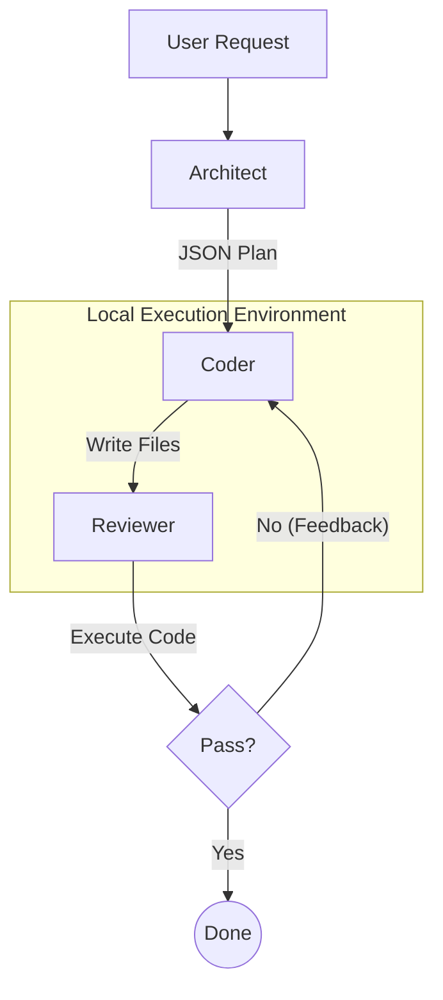

# System Architecture

## Overview

LISA (Local Intelligence Software Architect) is an autonomous multi-agent system designed for secure, air-gapped code generation. It uses a graph-based orchestration pattern to manage the flow of information between specialized AI agents, ensuring that generated code is not only syntactically correct but also functional and verified.

## Core Components

### 1. Orchestration Engine (LangGraph)
The system is built on **LangGraph**, which defines the stateful workflow. The application state (`AgentState`) is passed between nodes (agents), accumulating information such as the user request, the execution plan, the generated code, and review feedback.

### 2. The Agents

LISA employs three distinct agents, each utilizing a specialized local Large Language Model (LLM):

#### A. The Architect (`llama3.1:8b`)
*   **Role**: Planner and Strategist.
*   **Input**: User's natural language request.
*   **Responsibility**: 
    1.  Analyzes the intent of the request.
    2.  Decomposes the problem into a structured **Technical Execution Plan** (JSON).
    3.  Identifies necessary files, descriptions, and dependencies.
*   **Output**: A JSON object containing the file structure and step-by-step instructions.

#### B. The Coder (`qwen2.5-coder:7b`)
*   **Role**: Implementation Specialist.
*   **Input**: The Technical Execution Plan from the Architect and feedback from the Reviewer (if retrying).
*   **Responsibility**:
    1.  Iterates through the planned files.
    2.  Writes the actual code implementation for each file.
    3.  Saves the files to the local workspace.
*   **Output**: Source code files written to the disk.

#### C. The Reviewer (`mistral-nemo`)
*   **Role**: Quality Assurance and Tester.
*   **Input**: The generated code files.
*   **Responsibility**:
    1.  **Dynamic Analysis**: Executes the generated Python code to check for runtime errors.
    2.  **Feedback**: If execution fails, analyzes the traceback and provides specific instructions for the Coder to fix the issue.
    3.  **Approval**: If the code runs successfully, marks the task as approved.
*   **Output**: Review feedback (Approved/Changes Requested) and execution logs.

## Workflow Logic

The graph follows a **Self-Correction Loop**:

1.  **Start** -> **Architect**: Plans the task.
2.  **Architect** -> **Coder**: Implements the plan.
3.  **Coder** -> **Reviewer**: Tests the implementation.
4.  **Reviewer** -> **Condition**:
    *   **If Approved**: -> **End**.
    *   **If Failed**: -> **Coder** (with error feedback).
    *   **Max Retries**: The system limits retries (default: 3) to prevent infinite loops.

## Data Flow Diagram

